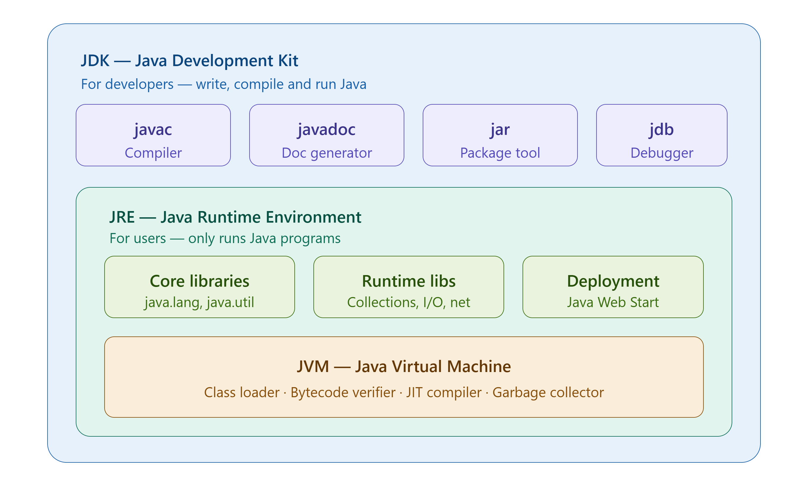

> # <span style="color:green;"> Java architecture  </span>

---


When we write java code, it goes through 3 layers before running on our computer:

```
our Code → Compiler → Bytecode → jVM → our Computer
```

Think of it like these:

- we  write a **recipe** (Java code)
- A **translator** converts it to a universal format (bytecode)
- A **kitchen** (JVM) cooks it on any machine

---

## JDK — Java development Kit

> "The full toolbox for developers"

**Who needs it ?** → Programmers who WRITE Java code

**What's inside:**
- `javac` → The compiler (converts .java to .class)
- `javadoc` → Generats documentation from your code
- `jar` → packagess your code into a single file
- `jdb` → debugger (helps find bugs)
- Everything in JRE 

**Simple analogy:** JDK is like a full carpenter workshop — you have all the tools to BUILD things.

---

## JRE — Java Runtime environment

> "Just enough to run Java programs"

**Who needs it?** → Regular users who only RUN Java apps (not write them)

**What's inside:**
- Core libraries (java.lang, java.util, etc.)
- Runtime libraries (Collections, I/O, Networking)
- Deployment tools
- JVM (see below)

**Simple analogy:** JRE is like having just a microwave — you can HEAT (run) food but not cook (build) from scratch.

---

## JVM — Java virtual machine

> "The engine that actually runs your code"

**Who needs it?** → Everyone. It's inside JRE and JDK both.

**What's inside:**

### 1. Class Loader
- Loads your `.class` (bytecode) files into memory
- does it in 3 steps: load → Link → initialize
- Think of it as: opening the recipe book before cooking

### 2. bytecode verifier
- Checks your code is safe before running it
- prevents viruses and bad code from harming your system
- think of it likes : a food safety check before eating

### 3. JIT Compiler (Just-In-Time)
- Makes Java FAST
- Detects code that runs often (hot code)
- Converts it to native machine code for speed
- think of it as: Memorizing a recipee so you cook it faster next time

### 4. Execution Engine
- actually RUNS your code
- Uses interpreter at first, then JIT compiled code
- Think of it's : the chef who actually cookss

### 5. Garbage collector
- Automatically deletes unused objects from memory
- u don't need to manage memory manually (unlike C/C++)
- think of it like: a cleaner who removes dirty dishes automatically

---

## JVM Memory areas

| Area        | What it stores                | Simple Meaning           |
|-------------|-------------------------------|--------------------------|
| Heap        | All objects and arrays        | Main storage room        |
| Stack       | Method calls, local variables | Notepad for current work |
| Method area | class info, static variables  | Reference shelf          |
| PC register | current instruction           | "What step am I on?"     |

---

## The Containment structuare

```
JDK (biggest — for developers)
│
├── javac, javadoc, jar, jdb (developer tools)
│
└── JRE (for running programs)
    │
    ├── Core libraries
    ├── Runtime libraries
    │
    └── JVM (the engine)
        │
        ├── Class loader
        ├── Bytecode Verifier
        ├── JIT compiler
        ├── Execution engine
        └── garbagge Collector
```

---

## Why This Design 

| Feature | benefit                               |
|---------|---------------------------------------|
| Bytecode | Same code runs on windows, nac, Linux |
| Bytecode Verifier | Safe from malicious code              |
| JIT Compiler | Near-native performance               |
| Garbage Collector | No memory Leaks, easier to code       |

> **Key quote:** "Write Once, Run anywhere" — This is Java's superpower, made possible by bytecode + JVM.

---

## Quick Memory trick

| Short form | Full name                | One line meaning |
|-----------|--------------------------|-----------------|
| JDK | java Development Kit     | For developers — build + run |
| JRE | java runtime Environment | For users — only run |
| JVM | java virtual machine     | The actual engine inside both |

---

## Interview questions on This topics

**Q: what is the difference between JDK, JRE and JVM?**
> JVM runs bytecode. JRE = JVM + libraries (to run programs). JDK = JRE + dev tools like javac (to write and compile programs).

**Q: is Java compiled or interpreted?**
> Both. javac compiles to bytecode (compile time). JVM interprets bytecode, and JIT compiles hot code to machine code (runtime). Java is a hybrid.

**Q: What is bytecode?**
> An intermediate format between java source code and Machine code. Not readable by CPU directly — only JVM understands it. Makes Java platform-independent.

**Q: What does the JIT compiler do ?**
> detects frequently Executed code (hot code) and compiles it to native machine code for faster execution. This is why Java gets faster the longer it runs.

**Q: What is garbage collectiion ?**
> automatic memory managgement. JVM finds objects no longer referenced and deletes them, freeing memory. Developer does not need to manually free memory.

---

