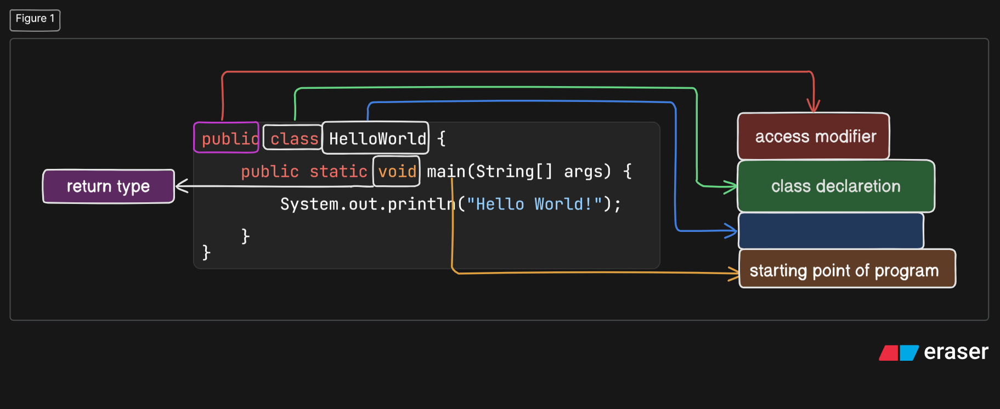

> # <span style="color:green" align="center" >Java Program explain </span>

---
>  

---
`code`
```java

public class HelloWorld {
    public static void main(String[] args) {
        System.out.println("Hello, World!");
    }
}
```
---
## 1. Public class HelloWorld 

 


- `public` is an access modifier. it means this class is visible to everything the JVM and other classes as well.

- `class` is the fundamental building block of java . Everything in java must lived inside a classes.
 
 - `Helloworld` is the class name. java enforces a strict rule: the class name should be same as filename so fie must be saved as `Helloworld.java`

---

## 2. Public static void main(String[] args)

> this is a starting point JVM looks for the axact signature to know where to start runnign our program .


- `public` --- JVM must be able to call this from outside , so it should be public. 


- `static` --- it is like class-level JVM calls `main` before any objects are created . thinks like  the method belongs to the class itself, not to an object created from that class. 


- `void` --- it is return type. void me nothing will be return.


- `main` --- the exact name the JVM expects. Change it to start or begin and nothing runs.


- `(String[] args)` --- it just hold extra information u passes at time of run program `args` is holding them.

---


